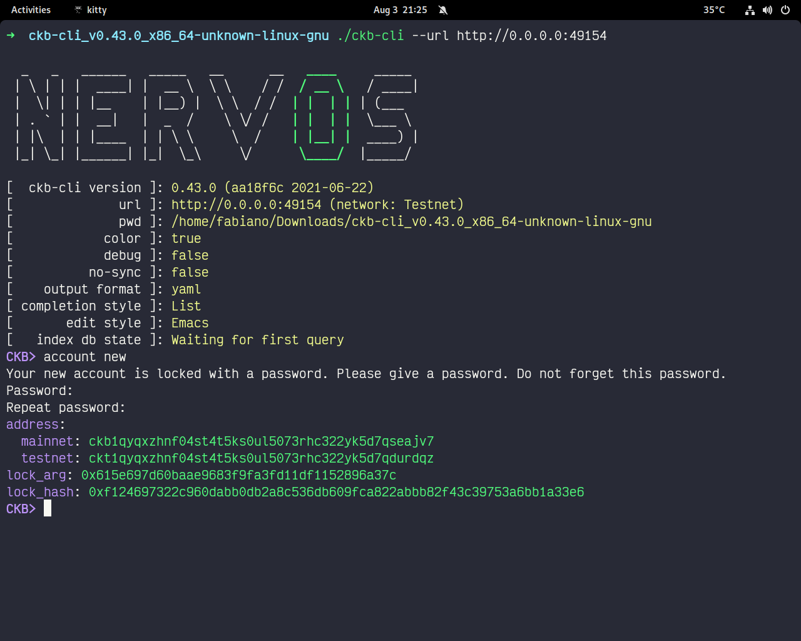
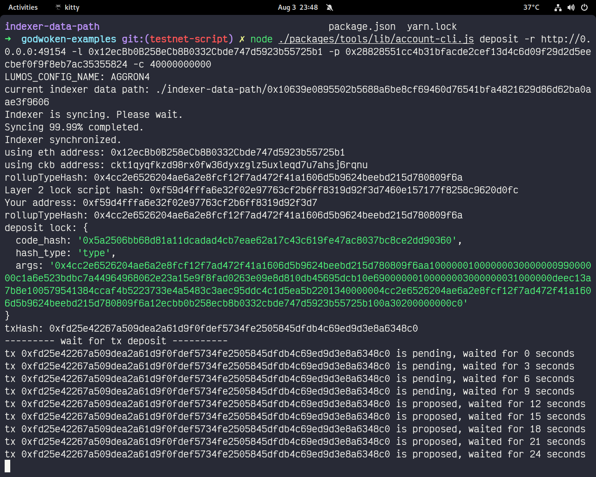

# submit task gitcoin: 2
[task gitcoin: 2](https://github.com/tooruSL/ckb-hackathon/tree/main/deploy-smart-contract)

## account fund
[account explorer](https://explorer.nervos.org/aggron/address/ckt1qyqfkzd98rx0fw36dyxzglz5uxleqd7u7ahsj6rqnu)

## account create

## deposit

