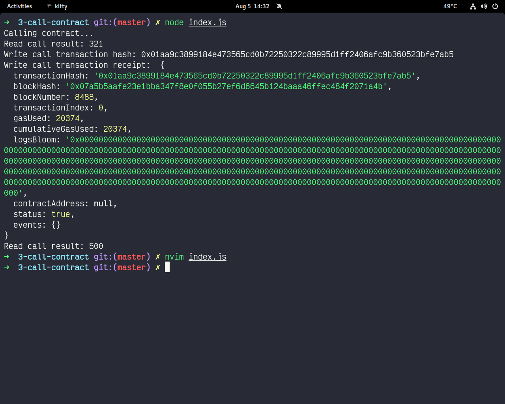

## transaction hash
0x01aa9c3899184e473565cd0b72250322c89995d1ff2406afc9b360523bfe7ab5

## contract address
0x6128EcF8cA252763AeC1d758E7E225B13071e8a9

## ABI of contract
```javascript
[
   {
     "inputs": [],
     "stateMutability": "payable",
     "type": "constructor"
   },
   {
     "inputs": [
       {
         "internalType": "uint256",
         "name": "x",
         "type": "uint256"
       }
     ],
     "name": "set",
     "outputs": [],
     "stateMutability": "payable",
     "type": "function"
   },
   {
     "inputs": [],
     "name": "get",
     "outputs": [
       {
         "internalType": "uint256",
         "name": "",
         "type": "uint256"
       }
     ],
     "stateMutability": "view",
     "type": "function"
   }
];
```
