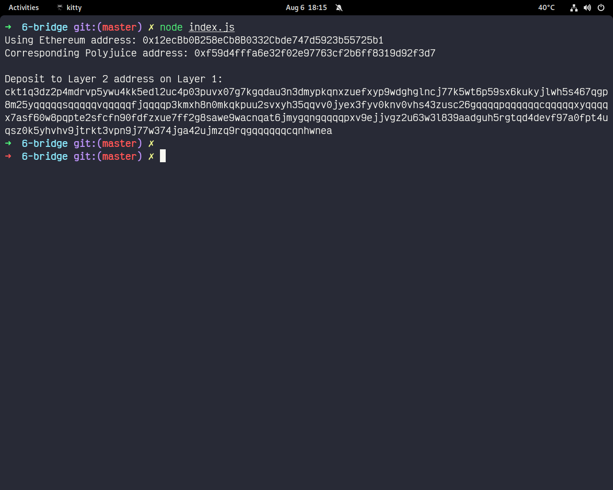

## receiver address
ckt1q3dz2p4mdrvp5ywu4kk5edl2uc4p03puvx07g7kgqdau3n3dmypkqnxzuefxyp9wdghglncj77k5wt6p59sx6kukyjlwh5s467qgp8m25yqqqqqsqqqqqvqqqqqfjqqqqp3kmxh8n0mkqkpuu2svxyh35qqvv0jyex3fyv0knv0vhs43zusc26gqqqqpqqqqqqcqqqqqxyqqqqx7asf60w8pqpte2sfcfn90fdfzxue7ff2g8sawe9wacnqat6jmygqngqqqqpxv9ejjvgz2u63w3l839aadguh5rgtqd4devf97a0fpt4uqsz0k5yhvhv9jtrkt3vpn9j77w374jga42ujmzq9rqgqqqqqqcqnhwnea

## ether address used to generate
0x12ecBb0B258eCb8B0332Cbde747d5923b55725b1

## etherscan
https://rinkeby.etherscan.io/tx/0xdc336138a969a3f23c6e73fccf74c554b609c742a027b1576967885fa412f50c

## nervos explorer
https://explorer.nervos.org/aggron/transaction/0xb1334f00bf603e90408f78aab3042069b29b45b57db160e96b64fc0433d7d1fb
