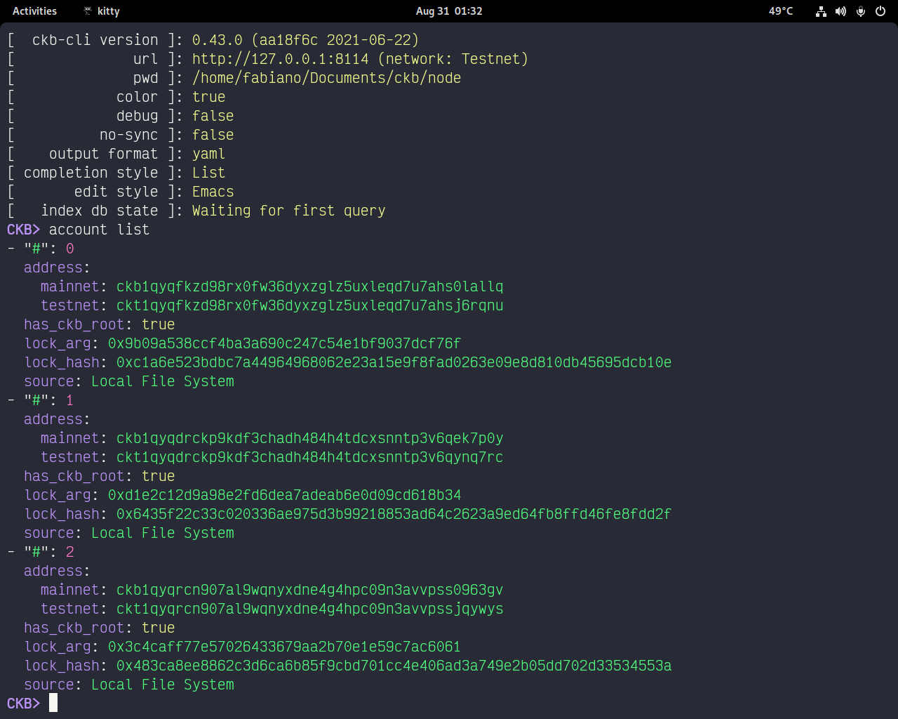
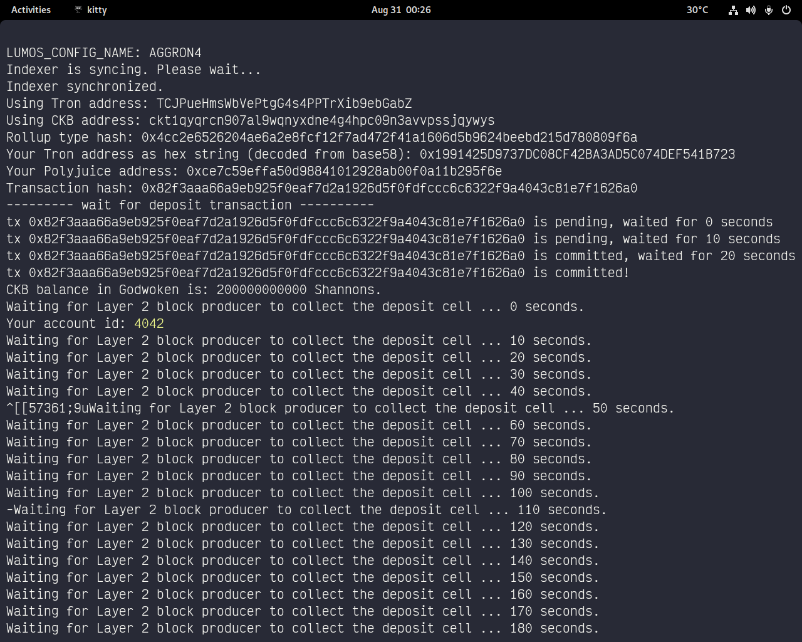
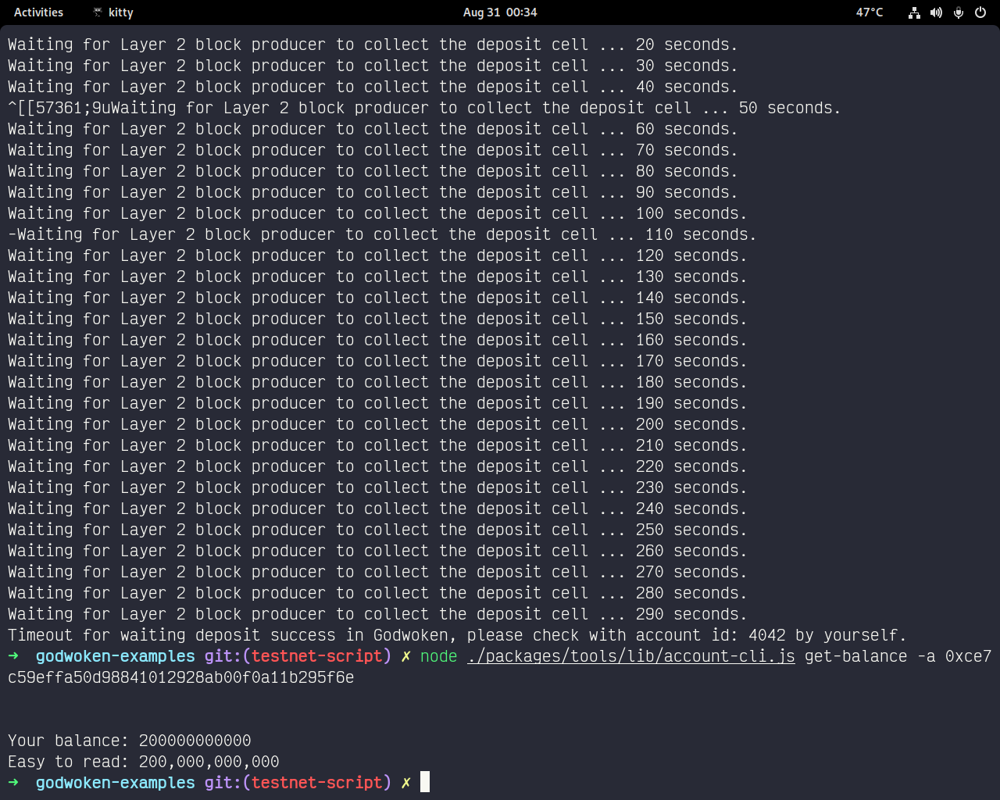
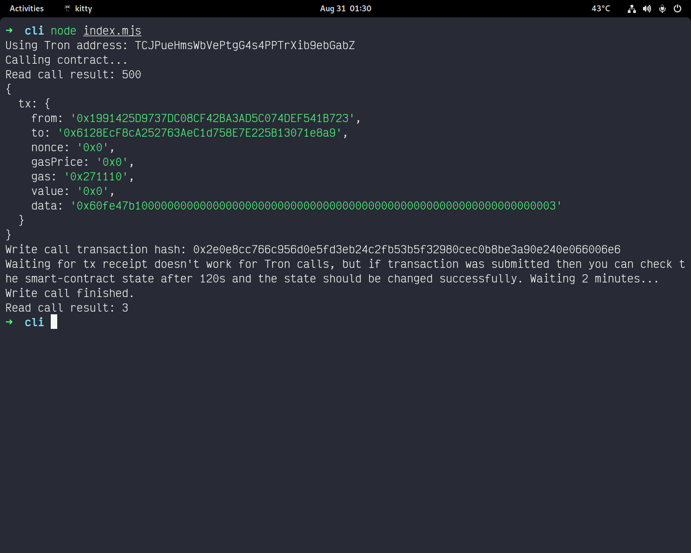

## account fund
[account explorer](https://explorer.nervos.org/aggron/address/ckt1qyqrcn907al9wqnyxdne4g4hpc09n3avvpssjqywys)






## tx
0x2e0e8cc766c956d0e5fd3eb24c2fb53b5f32980cec0b8be3a90e240e066006e6

## abi

```javascript
   {
     "inputs": [],
     "stateMutability": "payable",
     "type": "constructor"
   },
   {
     "inputs": [
       {
         "internalType": "uint256",
         "name": "x",
         "type": "uint256"
       }
     ],
     "name": "set",
     "outputs": [],
     "stateMutability": "payable",
     "type": "function"
   },
   {
     "inputs": [],
     "name": "get",
     "outputs": [
       {
         "internalType": "uint256",
         "name": "",
         "type": "uint256"
       }
     ],
     "stateMutability": "view",
     "type": "function"
   }
```

## Contract address
0x6128EcF8cA252763AeC1d758E7E225B13071e8a9

## Tron Address
TCJPueHmsWbVePtgG4s4PPTrXib9ebGabZ
